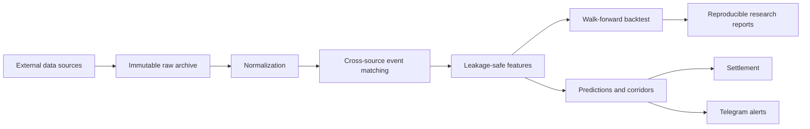

# Cyber Odds Research

[](https://github.com/aww1n/cyber-odds/actions/workflows/ci.yml)
[](https://www.python.org/)
[](https://www.docker.com/)

Система для воспроизводимого сбора и исследования коэффициентов на киберфутбол и
киберхоккей. Проект развивается по этапам: сначала подтверждение данных и формул,
затем хранение и collectors, normalization, baseline/backtest, и только после этого ML.

Текущий статус: **этапы 1–10 — сбор Fonbet/ESB/UEL, отдельный SIS H2H GGL,
нормализация, event matching, leakage-safe features, baseline и временной
backtester реализованы. Logistic Regression v1 с validation-only калибровкой
проверена и оказалась хуже простого baseline, поэтому не допущена к сигналам.
Семь базовых factor ID Fonbet подтверждены на текущей официальной странице, live
predictions/signals для 1X2 и тоталов, line-aware статистические коридоры, settlement,
Telegram и Docker Compose реализованы. В текущем
операционном профиле UEL eFootball алерты включены для forward-наблюдения, но
прибыльность стратегии не доказана и автоматического размещения ставок в проекте нет.
В текущем Fonbet line JSON подтверждён live-счёт, но не terminal status, поэтому
исчезнувшие матчи не выдаются за рассчитанные результаты**.

## Архитектура



Ключевой принцип проекта — любой прогноз строится только из данных, доступных на
момент соответствующего odds snapshot. Сырые ответы архивируются до parsing, а
backtest, обучение, прогноз и settlement разделены явными границами.

## Что здесь можно оценить

- воспроизводимый ingestion нескольких источников и сохранение raw evidence;
- source-scoped identity и отдельный этап event matching;
- rolling walk-forward без утечки будущих данных;
- раздельная оценка вероятностных метрик и ROI на доступной odds-выборке;
- идемпотентные predictions, alerts и settlement;
- production-контур с PostgreSQL, Redis, Docker Compose и health checks;
- тесты парсеров, репозиториев, matching, features, ML, Telegram и workers.

## Docker: рекомендуемый запуск

```bash
cp .env.example .env
# заполните POSTGRES_PASSWORD, TELEGRAM_BOT_TOKEN, TELEGRAM_ADMIN_IDS
# и TELEGRAM_ALERT_CHAT_ID (для канала обычно отрицательный -100... id)
docker compose up -d --build --force-recreate
```

Для чистого старта без старой БД: `docker compose down -v --remove-orphans` перед
`up`. После изменения `.env` используйте `--force-recreate`: простой `docker compose
restart` не перечитывает environment контейнера.

## Быстрый запуск текущего этапа

```bash
uv sync --extra dev --extra ml --extra telegram
uv run python -m app research-alerts
FONBET_BASE_URL=https://verified-line-host.example uv run python -m app collect --raw-only
ESB_ENABLED=true uv run python -m app backfill --participant Artrom --raw-only
UEL_ENABLED=true uv run python -m app backfill --source uel --raw-only
SIS_H2H_ENABLED=true uv run python -m app backfill --source sis-h2h --date 2026-08-16 --raw-only
uv run python -m app normalize --source uel_ef
uv run python -m app normalize --source fonbet
uv run python -m app match-events --historical-source uel_ef
uv run python -m app db-audit
uv run python -m app build-corridors
uv run python -m app corridor-progress
uv run python -m app corridor-stats
DATABASE_URL=sqlite+aiosqlite:///data/research.sqlite3 uv run python -m app backtest
DATABASE_URL=sqlite+aiosqlite:///data/research.sqlite3 uv run python -m app train
DATABASE_URL=sqlite+aiosqlite:///data/research.sqlite3 uv run python -m app predict
DATABASE_URL=sqlite+aiosqlite:///data/research.sqlite3 uv run python -m app settle
uv run python -m app telegram
uv run python -m app run --role all
uv run pytest
uv run ruff check .
uv run mypy
```

Команда `research-alerts` читает наблюдаемые значения из
`research/known_alerts.json` и воспроизводимо формирует CSV/JSON с выведенными
вероятностями и ошибками формул.

`collect` не содержит скрытого endpoint: `FONBET_BASE_URL` обязателен. Без
`--raw-only` база должна быть заранее приведена к `alembic upgrade head`. Каждый ответ
архивируется точными байтами вместе с metadata sidecar до parsing/записи в БД.
Подтверждённые factor ID `921/922/923`, `927/928`, `930/931` нормализуются как
1X2, нулевые/параметрические форы и тоталы. Все остальные factor ID остаются
`unmapped_factor`; доказательство хранится в `research/fonbet_factor_evidence.json`.

`backfill` сейчас реализует подтверждённый participant-driven путь ESportsBattle.
По умолчанию он берёт один завершённый турнир с указанной страницы; объём явно
расширяется через `--max-tournaments`. Внешние identity сохраняются source-scoped и
не объявляются каноническими до отдельного этапа normalization.

Для `--source uel` используется официальный UEL POST-контракт. Тело каждого
запроса сохраняется в RAW metadata; исходная timezone расписания задаётся через
`UEL_SOURCE_TIMEZONE` и не угадывается внутри parser. Текущий подтверждённый default
`Europe/Moscow` получен сопоставлением полной последовательности пар UEL с Fonbet.

`--source sis-h2h` использует официальный публичный API H2H Global Gaming League,
на который ссылается SIS. Источник хранится под кодом `sis_h2h_esoccer`: его нельзя
смешивать с Fonbet `FC 26. H2H LIGA`, потому что текущие пулы игроков не совпадают.
Дата обязательна и преобразуется в timezone-aware начало суток согласно
`SIS_H2H_SOURCE_TIMEZONE`; ответы API уже содержат UTC timestamp.

`backtest` строит признаки заново для каждого события со строгим cutoff и запускает
rolling walk-forward. Он отдельно сравнивает окна 5/10/20/25/30/50/75/100/200/all.
Probability-метрики считаются по всему допустимому OOS-интервалу; ROI для 1X2 и
тоталов считается только там, где есть сопоставленный свежий prematch odds snapshot.
Отчёт явно разделяет эти выборки, чтобы статистическое качество не выдавалось за
доходность.

`train` требует установку `uv sync --extra dev --extra ml`. В каждом fold модель
обучается на train, метод калибровки выбирается только на следующем validation и
оценивается один раз на будущем test. Итог сравнения зафиксирован в
[`docs/ml-v1-backtest.md`](docs/ml-v1-backtest.md).

`predict` берёт только автоматически matched будущие события и конкретный сохранённый
odds snapshot. 1X2 и тоталы имеют отдельные вероятностные модели и стратегии; линия
тотала является частью prediction, corridor и alert identity. Cutoff признаков равен
времени получения этого snapshot, даже если время
начала у UEL и Fonbet расходится. Каждый прогноз получает запись `alert` или `skip`;
прогноз также хранит точный `event_match_id` и frozen `mapping_reversed_sides`, чтобы
settlement не мог выбрать результат другого источника или изменить ориентацию P1/P2 после
повторного matching. Unsent Telegram alert имеет expiry по свежести odds/старту события;
просроченная рекомендация демотируется в `skip`. Повторный запуск идемпотентен. В
[`config/strategies.yaml`](config/strategies.yaml)
`uel_football.alerts_enabled: true` и `min_samples: 12` включены осознанно для
forward-наблюдения. Это не является подтверждением betting edge: стратегия должна
оцениваться только по уникальным, реально выданным сигналам и последующим settlement.

`telegram` запускает whitelist-only aiogram bot и publisher. При старте бот проверяет
доступность `TELEGRAM_ALERT_CHAT_ID`; неправильный ID/отсутствие доступа теперь приводит
к явной ошибке контейнера вместо ситуации, когда polling работает, а сигналы молча не
доставляются. Один неотправляемый сигнал не блокирует очередь остальных. Publisher
логирует pending/sent/expired delivery cycles. Поддержаны `/status`, `/stats`, `/today`,
`/models`, `/model`, `/signals`, `/results`, `/bank`, `/backtest`, `/analysis`,
`/parsers`, `/errors`.
Реальные ставки нигде не выполняются.

History worker всегда обновляет первую страницу UEL и параллельно циклически проходит
страницы 2..N. Поэтому `HISTORY_MAX_TOURNAMENTS=100` больше не означает «только первые
100 турниров навсегда»: старые страницы постепенно backfill'ятся автоматически. HTTP
запросы tour-data ограничены десятью одновременными запросами, чтобы не создавать burst
из 100 соединений.

Production-контуры описаны в [`docs/production-runbook.md`](docs/production-runbook.md).
Сводка доказанных формул, OOS-метрик и оставшихся исследовательских ограничений — в
[`docs/final-research-status.md`](docs/final-research-status.md).

Не добавляйте в репозиторий секреты или сырые ответы внешних сервисов. Не используйте
примеры из спецификации как исторические наблюдения: поле `evidence_kind` отличает их
от будущих подтверждённых алертов.
